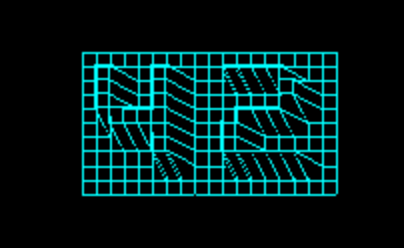

# FDF – 42 Project

## Overview

**FDF** (Fil de Fer / Wireframe) is a 42 School graphics project where the goal is to render a 3D wireframe representation of a terrain map using a simple graphics library (MiniLibX).

This project takes a height map (`.fdf` file) and:

* Parses elevation data
* Projects it into 2D using an isometric projection
* Renders the result as a wireframe
* Applies color gradients based on altitude
* Allows real-time transformations via keyboard input

The result is an interactive 3D visualization built entirely from scratch in C.

---

## Preview

### Height Map (Color Gradient)


### 3D Wireframe Rendering


### Grid / Line Rendering



---

## Features

* ✅ **Isometric 3D projection**
* ✅ **Dynamic color gradients** based on altitude
* ✅ **Efficient line drawing (Bresenham-inspired)**
* ✅ **Zoom, translation, and height scaling**
* ✅ **Keyboard controls**
* ✅ **Clean memory management** (no leaks)

---

## Controls

| Key             | Action                                      |
| --------------- | ------------------------------------------- |
| `W / A / S / D` | Move (pan) the map                          |
| `↑ / ↓`         | Increase / decrease grid size (zoom)        |
| `+ / -`         | Increase / decrease height factor (Z scale) |
| `Q / E`         | Rotate (isometric delta)                    |
| `G / H`         | Rotate around Y axis                        |
| `L`             | Cycle projection modes                      |
| `C`             | Cycle color palettes                        |
| `ESC`           | Exit program                                |

---|---|
| `W / A / S / D` | Move map |
| `+ / -` | Zoom in / out |
| `↑ / ↓` | Increase / decrease height |
| `ESC` | Exit program |

---

## Algorithm Highlights

### 1. Map Parsing

* Reads `.fdf` files line by line
* Splits values into a 2D integer matrix
* Stores map width, height, and elevation range

```c
z = ft_atoi(token);
```

This ensures the map is fully validated before rendering.

---

### 2. Isometric Projection

Each 3D point `(x, y, z)` is projected into 2D space using an isometric transform:

```c
iso_x = (x - y) * cos(ANGLE);
iso_y = (x + y) * sin(ANGLE) - z * height_scale;
```

**Why this works:**

* Preserves depth perception without perspective math
* Simple, fast, and visually clear
* Perfect for grid-based terrain

---

### 3. Line Drawing Algorithm (Core Rendering)

The wireframe is drawn using a **custom Bresenham-style algorithm**, optimized for MiniLibX:

* Integer-only calculations (fast)
* Handles all slopes
* Draws pixel-perfect connections between points

```c
while (x0 != x1 || y0 != y1)
{
    plot_pixel(x0, y0);
    e2 = 2 * err;
    if (e2 > -dy) { err -= dy; x0 += sx; }
    if (e2 < dx)  { err += dx; y0 += sy; }
}
```

**Key advantages:**

* No floating-point drift
* Consistent visual output
* Essential for smooth wireframes

---

### 4. Color Gradient Algorithm

Colors are interpolated based on altitude:

* Low altitude → Green
* Mid altitude → Yellow
* High altitude → Red

```c
color = interpolate(min_z, max_z, current_z);
```

This adds immediate visual depth and makes terrain features easy to read.

---

### 5. Rendering Pipeline

1. Parse map
2. Center map
3. Apply zoom
4. Apply height scaling
5. Apply isometric projection
6. Draw horizontal & vertical lines

This pipeline ensures **clean separation of concerns** and easy debugging.

---

## Compilation & Usage

### Requirements

* macOS or Linux
* `gcc` compiler
* MiniLibX (provided by 42)

---

### Compilation

```bash
make
```

This will generate the `fdf` executable.

To clean object files:

```bash
make clean
```

To clean everything (objects + executable):

```bash
make fclean
```

To recompile from scratch:

```bash
make re
```

---

### Usage

```bash
./fdf <map.fdf>
```

Example:

```bash
./fdf maps/42.fdf
```

---

### Runtime Controls

| Key             | Action                                      |
| --------------- | ------------------------------------------- |
| `W / A / S / D` | Move (pan) the map                          |
| `↑ / ↓`         | Increase / decrease grid size (zoom)        |
| `+ / -`         | Increase / decrease height factor (Z scale) |
| `Q / E`         | Rotate (isometric delta)                    |
| `G / H`         | Rotate around Y axis                        |
| `L`             | Cycle projection modes                      |
| `C`             | Cycle color palettes                        |
| `ESC`           | Exit program                                |
